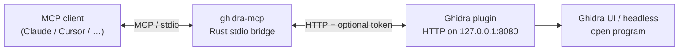

# ghidra-mcp

[](https://github.com/imjustprism/ghidra-mcp/actions/workflows/ci.yml)
[](LICENSE)
[](rust-toolchain.toml)
[](https://ghidra-sre.org/)
[](https://adoptium.net/)

**MCP server for [Ghidra](https://ghidra-sre.org/).** A small Rust bridge plus a Ghidra Java plugin that expose a live reversing session to any MCP client (Claude Desktop, Cursor, VS Code, custom agents, …).

Decompile, rename, patch, scan live memory, drive the debugger, recover types, triage malware — all from the model, against the program you already have open in Ghidra.

> [!IMPORTANT]
> The plugin binds to **loopback only** by default (`127.0.0.1:8080`). Never expose it on a public interface. Prefer setting an auth token in Tool Options.

---

## Architecture



| piece | role |
| --- | --- |
| **Rust bridge** (`ghidra-mcp`) | MCP server over stdio. Translates tool calls into HTTP against the plugin. |
| **Java plugin** (`ghidra-mcp-plugin`) | Runs inside Ghidra. Serves endpoints for listing, decompile, edit, emulator, debugger, live process attach, … |
| **Optional headless script** (`ghidra-scripts/ServeMcp.java`) | Lightweight read-only HTTP surface for `analyzeHeadless` without the full UI plugin. |

---

## Requirements

| dependency | version / notes |
| --- | --- |
| [Ghidra](https://github.com/NationalSecurityAgency/ghidra/releases) | **12.1.2** (extension metadata targets this release) |
| JDK | **21** (Temurin / Adoptium recommended) |
| Rust | **1.85+** stable (`rustup` + `cargo`) |
| Maven | **3.9+** (plugin build) |
| OS | Windows is the primary path for live attach / debugger helpers; Linux/macOS work for static analysis tools |

---

## Quick start

### 1. Build the Rust bridge

```bash
cargo build --release
# binary: target/release/ghidra-mcp  (or .exe on Windows)
```

Ship profile (slower, max LTO):

```bash
cargo build --profile dist
```

### 2. Build the Ghidra plugin

```powershell
# Stage Ghidra jars into plugin/lib (required for Maven system-scoped deps)
cd plugin
.\setup-libs.ps1 -GhidraHome "C:\path\to\ghidra_12.1.2_PUBLIC"
# or: $env:GHIDRA_HOME = "..."; .\setup-libs.ps1

mvn clean package
# zip: plugin/target/ghidra-mcp-plugin-1.0.zip
```

### 3. Install the extension in Ghidra

1. **File → Install Extensions… → +** and pick `plugin/target/ghidra-mcp-plugin-1.0.zip`
2. Restart Ghidra
3. **File → Configure → Developer → ghidra-mcp-plugin** → enable
4. Open a program. Confirm the HTTP server is up (default `http://127.0.0.1:8080/`)

### 4. Point your MCP client at the bridge

**Claude Desktop** (`%APPDATA%\Claude\claude_desktop_config.json` on Windows, `~/Library/Application Support/Claude/claude_desktop_config.json` on macOS):

```json
{
  "mcpServers": {
    "ghidra": {
      "command": "C:/path/to/ghidra-mcp.exe",
      "args": ["--ghidra-server", "http://127.0.0.1:8080/"]
    }
  }
}
```

**Cursor / other stdio MCP hosts** — same idea: run the bridge binary with `--ghidra-server` pointing at the plugin.

Optional auth (must match **Edit → Tool Options → Ghidra MCP HTTP Server → Auth Token**):

```json
"args": [
  "--ghidra-server", "http://127.0.0.1:8080/",
  "--ghidra-token", "your-shared-secret"
]
```

### One-shot Windows deploy (optional)

```powershell
$env:GHIDRA_HOME = "C:\ghidra_12.1.2_PUBLIC"
.\deploy.ps1            # build plugin + bridge, install extension
.\deploy.ps1 -Relaunch  # also start Ghidra
.\deploy.ps1 -Dist      # fat-LTO Rust profile
```

---

## Bridge flags

| flag | env | default |
| --- | --- | --- |
| `--ghidra-server` | `GHIDRA_SERVER` | `http://127.0.0.1:8080/` |
| `--timeout-secs` | `GHIDRA_TIMEOUT_SECS` | `180` |
| `--ghidra-token` | `GHIDRA_TOKEN` | unset |
| `--replace-siblings` | `GHIDRA_MCP_REPLACE_SIBLINGS` | off (only reaps orphans whose parent died) |
| `--detach` | `GHIDRA_MCP_DETACH` | off (exit when MCP host dies, after health misses) |

```bash
RUST_LOG=ghidra_mcp=debug ./target/release/ghidra-mcp
```

---

## Plugin options

**Edit → Tool Options → Ghidra MCP HTTP Server**

| option | default | notes |
| --- | --- | --- |
| Server Port | `8080` | Match `--ghidra-server` |
| Bind Address | `127.0.0.1` | Keep loopback unless you know what you are doing |
| Auth Token | empty | If set, every request needs the matching bridge token |
| File IO Directory | empty | Empty disables import/export/`write_artifact` |

---

## Tools

**184 tools total.**

Common conventions on most paginated read tools:

- **fmt** — `tsv` (default), `csv`, `json`, or `verbose`
- **offset** / **limit** — pagination
- **program** — open program name or sha256 (otherwise the active program)

<details>
<summary><b>Listing / metadata</b> (42)</summary>

| tool | purpose |
| --- | --- |
| `list_scripts` | available Ghidra scripts (.java/.py) |
| `list_classes` | namespace classes |
| `list_segments` | memory segments |
| `list_imports` | imported symbols (with IAT VA) |
| `list_exports` | exported symbols |
| `list_namespaces` | namespaces |
| `list_data_items` | defined data |
| `search_functions_by_name` | substring match on function names |
| `get_function_by_address` | resolve function by address |
| `get_current_address` | cursor address |
| `get_current_function` | function at cursor |
| `list_functions` | functions (with_address name+addr or names-only) |
| `list_sections_detailed` | sections + RWX + entropy |
| `detect_protector` | packer/protector indicators |
| `analyze_virtualization` | VM/engine entry points + reverse calls |
| `obfuscation_profile` | one-call obfuscation verdict |
| `detect_security_mitigations` | PE hardening (ASLR/DEP/CFG/SafeSEH/GS) |
| `list_tls_callbacks` | PE TLS callbacks |
| `tls_singleton_map` | TLS slot map (+ live ptrs after live_attach) |
| `nebula_container_layout` | container layout recovery from decompile |
| `nebula_assert_helpers` | locate n_assert / n_error / n_warning helpers |
| `nebula_engine_survey` | Nebula3 readiness: auto-names + assert callers |
| `seed_nebula_helpers` | auto-discover/name n_assert/n_error/n_warning |
| `name_from_n_assert` | mass-name FUN_* (sigs or decompile modes) |
| `name_from_signatures` | fast name from __cdecl signature string xrefs |
| `list_nebula_instances` | list ::Instance() singleton signature sites |
| `name_nebula_instances` | rename auto FUN_* that are Type::Instance() |
| `raknet_packet_lookup` | DSO RakNet packet id → name/notes/handler |
| `assemble_code` | assemble asm text to bytes |
| `extract_api_call_sequences` | ordered API-call trace of a function |
| `vm_descriptor_table` | virtualizer dispatch table map |
| `list_entry_points` | entry points |
| `program_info` | language, arch, base, sha256 |
| `program_metadata` | full metadata map |
| `function_stack_frame` | stack variables for a function |
| `list_strings` | defined strings (optional regex + xrefs) |
| `list_relocations` | relocation entries |
| `list_bookmarks` | analysis bookmarks |
| `extract_iocs` | URLs/IPs/emails/registry/paths/GUIDs/wallets |
| `find_rop_gadgets` | ROP gadgets (ret-terminated) |
| `find_format_string_vulns` | printf-family non-constant format (CWE-134) |
| `export_offsets` | name+RVA skeleton (tsv/cpp) |

</details>

<details>
<summary><b>Decompile / disasm</b> (4)</summary>

| tool | purpose |
| --- | --- |
| `decompile` | C pseudocode by name or address (clean=true strips noise) |
| `disassemble_function` | raw assembly for a function |
| `instruction_at` | single instruction at address |
| `pcode_function` | raw p-code per instruction |

</details>

<details>
<summary><b>Xrefs / CFG / diff</b> (20)</summary>

| tool | purpose |
| --- | --- |
| `xrefs` | references (direction=both|to|from) |
| `list_callers` | direct callers |
| `list_callees` | direct callees |
| `basic_blocks` | CFG basic blocks |
| `function_string_refs` | strings referenced by a function |
| `callgraph` | call graph (mermaid|dot) |
| `function_cfg` | Mermaid CFG for one function |
| `cfg_metrics` | block/edge/cyclomatic/loop complexity |
| `dominator_tree` | immediate dominators of basic blocks |
| `xref_graph` | one-hop reference graph (mermaid|html) |
| `namespace_graph` | Mermaid namespace/class hierarchy |
| `struct_diagram` | Mermaid classDiagram of a struct |
| `taint_forward` | forward data-flow slice |
| `taint_backward` | backward data-flow slice |
| `diff_functions` | structural/semantic compare or dual decompile |
| `diff_programs` | whole-program function matching by shape hash |
| `propagate_matches` | copy names onto matches in another open program |
| `function_summary_bundle` | decompile + callers + callees + strings (+ API trace) |
| `function_field_writes` | field/vtable-write summary + strings |
| `function_hash` | structural or semantic function hash |

</details>

<details>
<summary><b>Bytes / patching / IO</b> (11)</summary>

| tool | purpose |
| --- | --- |
| `read_bytes` | raw hex bytes |
| `search` | kind=bytes|string|signature (bytes is cursor-resumable) |
| `patch_bytes` | write hex (optional re-disassembly) |
| `hex_dump` | formatted hex dump |
| `nop_range` | patch range with NOPs |
| `export_binary` | dump program bytes |
| `write_artifact` | write allow-listed UTF-8 artifact under File IO Directory |
| `save_program` | persist renames/comments/patches |
| `xor_decrypt` | XOR a memory range |
| `import_memory_dump` | load bytes from file into memory |
| `create_label` | add a label |

</details>

<details>
<summary><b>Rename / types / batch edit</b> (17)</summary>

| tool | purpose |
| --- | --- |
| `rename` | rename function / data / variable (kind=…) |
| `set_decompiler_comment` | PRE / plate comment |
| `set_disassembly_comment` | EOL comment |
| `set_function_prototype` | set full function prototype |
| `set_local_variable_type` | retype a local variable |
| `import_c_header` | parse C header into types |
| `demangle_symbol` | demangle one C++ symbol |
| `demangle_all` | demangle + rename all |
| `create_struct` | new StructureDataType |
| `create_union` | new UnionDataType |
| `create_enum` | new EnumDataType |
| `batch_rename` | many renames, one transaction |
| `batch_set_comment` | many comments, one transaction |
| `batch_set_prototype` | many prototypes, one transaction |
| `batch_set_variable_type` | many local retypes, one transaction |
| `set_variables` | atomic name + prototype + locals on one function |
| `apply_naming_convention` | batch-normalize names (dry-run by default) |

</details>

<details>
<summary><b>Type recovery / analysis control</b> (17)</summary>

| tool | purpose |
| --- | --- |
| `analyze_program` | run/re-run Ghidra auto-analysis |
| `list_analyzers` | analyzer names + on/off state |
| `set_analysis_option` | toggle an analyzer before analysis |
| `apply_data_type` | lay a type at an address |
| `batch_apply_data_type` | apply many types, one transaction |
| `create_function` | disassemble + create function at address |
| `propagate_function_types` | commit decompiler-inferred types/names |
| `recover_rtti_classes` | C++ classes + vftable + method count |
| `list_data_type_archives` | program/builtin/GDT type archives |
| `apply_gdt` | merge a .gdt archive (sandboxed path) |
| `import_dwarf` | run DWARF analyzer for types/sigs |
| `import_pdb` | run PDB analyzer for MS debug symbols |
| `apply_fid_signatures` | Function ID library/runtime naming |
| `propose_struct_from_accesses` | infer struct from pointer accesses |
| `list_open_programs` | all open programs (name, active, sha256) |
| `select_program` | switch active program by name/sha256 |
| `struct_field` | set/delete struct field at offset |

</details>

<details>
<summary><b>Self-driving RE / discovery</b> (9)</summary>

| tool | purpose |
| --- | --- |
| `function_completeness` | score one function 0-100 with breakdown |
| `find_undocumented` | functions ranked least-documented first |
| `ghidra_eval` | run Java/Python with full Ghidra API (+ live helpers) |
| `live_probe_snippets` | reusable Java snippets for live probes |
| `refine_function` | re-analyze + retype one function; report delta |
| `analysis_note` | record a freeform analysis note |
| `analysis_notes` | list recorded analysis notes |
| `search_tools` | keyword-search this server's tool catalog |
| `get_tool_schema` | full JSON input schema for one tool |

</details>

<details>
<summary><b>Signatures / malware triage</b> (26)</summary>

| tool | purpose |
| --- | --- |
| `find_encoded_strings` | xor-encoded string blobs |
| `find_api_hashes` | resolve hashed imports |
| `find_stack_strings` | stack-built strings |
| `high_entropy_regions` | packed/encrypted high-entropy zones |
| `find_anti_debug` | known anti-debug APIs |
| `find_orphan_gaps` | code outside any function |
| `vtable_scan` | heuristic vtable finder |
| `find_check_function` | crackme check-function locator |
| `extract_constraints` | cmp/branch constraints |
| `simplify_expression` | recover linear-MBA normal form |
| `find_opaque_predicates` | always-true/false conditional branches |
| `find_magic_constants` | magic immediate operands |
| `neutralize_anti_debug` | patch anti-debug calls to return 0 |
| `idiom_simplifier` | annotate arithmetic idioms |
| `make_signature` | unique wildcarded AOB signature |
| `resolve_relative` | resolve call/jmp/RIP-relative targets |
| `find_crypto_constants` | AES/SHA/MD5/CRC constant tables |
| `find_syscalls` | syscall/sysenter/int 2e stubs + SSN |
| `find_anti_vm` | VM/sandbox artifact strings |
| `cfg_obfuscation_score` | CFG-flattening / obfuscation score |
| `unpack_assist` | packer/protector detection score |
| `coverage` | coverage report / from_trace / diff |
| `decode_strings_auto` | brute-force XOR/ADD/SUB string decode |
| `find_dynamic_api_resolution` | GetProcAddress/LoadLibrary call sites |
| `find_function_by_string` | string xref to function entry + signature |
| `emulate` | one-shot p-code emulation |

</details>

<details>
<summary><b>Emulation sessions</b> (4)</summary>

| tool | purpose |
| --- | --- |
| `emulate_function` | emulate one function with args; read return |
| `recover_decoded_strings` | emulate a decoder; harvest produced strings |
| `emu_start` | start persistent p-code emulator session |
| `emu_session` | drive session (step/run_to/regs/setreg/read/write/close) |

</details>

<details>
<summary><b>Debugger</b> (20)</summary>

| tool | purpose |
| --- | --- |
| `debugger_status` | trace/target state |
| `debugger_list_targets` | debug targets |
| `debugger_list_modules` | loaded modules |
| `debugger_threads` | live threads |
| `debugger_stack_trace` | call stack of a thread |
| `debugger_registers` | frame registers |
| `debugger_read_memory` | live target memory |
| `debugger_list_breakpoints` | logical breakpoints |
| `debugger_set_breakpoint` | set breakpoint |
| `debugger_remove_breakpoint` | remove breakpoint |
| `debugger_continue` | resume target |
| `debugger_step_into` | step into |
| `debugger_step_over` | step over |
| `debugger_break` | interrupt target |
| `debugger_list_offers` | available launchers/connectors |
| `debugger_backend_log` | recent debugger backend log lines |
| `debugger_launch` | launch/attach from MCP |
| `debugger_detach` | detach without killing |
| `debugger_translate_static_to_dynamic` | static address to live |
| `debugger_translate_dynamic_to_static` | live address to static |

</details>

<details>
<summary><b>Live process</b> (14)</summary>

| tool | purpose |
| --- | --- |
| `live_processes` | enumerate running processes |
| `live_attach` | connector-less attach by name/pid |
| `live_release` | release live anchor (process untouched) |
| `live_modules` | modules of attached process |
| `live_threads` | threads of attached process |
| `lua_find_state` | auto-detect embedded Lua 5.1 lua_State |
| `lua_exec` | run Lua inside live embedded VM (override hook/fn defaults per target) |
| `freeze` | hold/release a live value (op=on|off|list) |
| `scan` | live memory scan session (op=first|next|results|close) |
| `read_pointer_path` | resolve multi-level pointer chain |
| `live_read_struct` | read typed live-memory fields from a schema |
| `pointer_scan` | reverse-scan image for pointers into a target |
| `live_write_memory` | write live process memory |
| `live_write_register` | write live register |

</details>

> Live attach and Lua helpers are powerful. They require an attached process and, for `lua_exec`, target-specific function addresses when built-in example defaults do not match.

## Prompts

MCP prompts (slash commands in clients that support them):

| prompt | purpose |
| --- | --- |
| `survey_binary` | first-pass survey: layout, capabilities, IOCs, next steps |
| `analyze_function` | deeply analyze + document one function (`address`) |
| `triage_malware` | anti-analysis, capabilities, encoded data, crypto |
| `solve_crackme` | locate + solve a validation routine |
| `recover_types` | RTTI / FID / demangle / propagate |
| `bootstrap_dro_client` | full Nebula3/DSO bootstrap: survey → assert names → TLS → RakNet |
| `name_nebula_functions` | mass-recover symbols from n_assert / n_error / n_warning |
| `analyze_raknet_handler` | map packet id or handler address to DSO protocol + document |

## Resources

| URI | content |
| --- | --- |
| `ghidra://program/info` | language, arch, base, sha256 |
| `ghidra://program/current-function` | function at the cursor |
| `ghidra://program/current-address` | cursor address |
| `ghidra://debugger/status` | live trace/target state |
| `ghidra://dro/nebula-playbook` | Nebula3 / DSO RE playbook (assert naming, TLS, containers) |
| `ghidra://dro/raknet-overview` | RakNet layers, magic, handshake for DSO |
| `ghidra://dro/raknet-packet-ids` | packet id table (0x05–0x8e, ACK/NACK) |
| `ghidra://dro/raknet-flows` | login / map / combat / heartbeat flows |

---

## Development

```bash
# Rust
cargo fmt --all -- --check
cargo clippy --all-targets --locked -- -D warnings
cargo test --all-targets --locked
cargo deny check   # bans / licenses / advisories (see deny.toml)

# Java plugin (after setup-libs.ps1)
cd plugin && mvn -B test package
```

| path | contents |
| --- | --- |
| `src/` | Rust MCP bridge |
| `plugin/` | Ghidra extension (Maven) |
| `ghidra-scripts/` | optional headless HTTP script |
| `tools/yeet-comments.py` | enforce zero source comments (project style) |
| `deploy.ps1` | Windows build + install helper |
| `.github/workflows/ci.yml` | Rust (Linux/Windows) + Maven + cargo-deny |

Project style leans hard on short, type-safe code with **no source comments** (names and types carry meaning; MCP/CLI help lives in attributes).

---

## Troubleshooting

| symptom | fix |
| --- | --- |
| bridge: `error sending request` | Ghidra not running, plugin disabled, wrong port, or firewall |
| plugin missing from Configure | look under **Developer**, not the default category |
| port 8080 busy | change Tool Options port; match `--ghidra-server` |
| zip won't install | need **JDK 21** and **Ghidra 12.1.2** |
| Maven can't find jars | run `plugin/setup-libs.ps1 -GhidraHome …` first |
| debugger tools stubbed | stage optional Debugger jars via `setup-libs.ps1` (warnings if missing) |
| auth failures | set the same token in Tool Options and `--ghidra-token` / `GHIDRA_TOKEN` |

---

## Security

- Loopback bind + optional shared token are the primary controls.
- File IO is off until you set **File IO Directory**.
- `ghidra_eval`, live write tools, and `lua_exec` can modify targets — treat them as powerful and intentional.
- See [SECURITY.md](SECURITY.md) for reporting issues.

---

## License

Apache-2.0. See [LICENSE](LICENSE) and [NOTICE](NOTICE).

Ghidra is a trademark of the National Security Agency. This project is not affiliated with or endorsed by the NSA.
