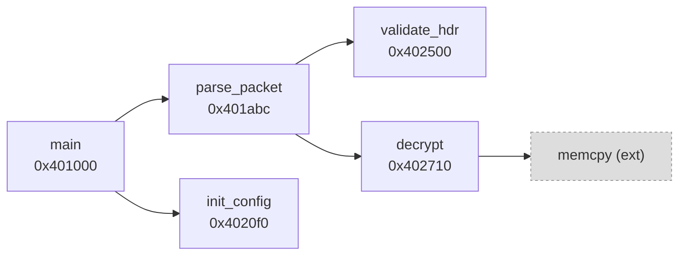
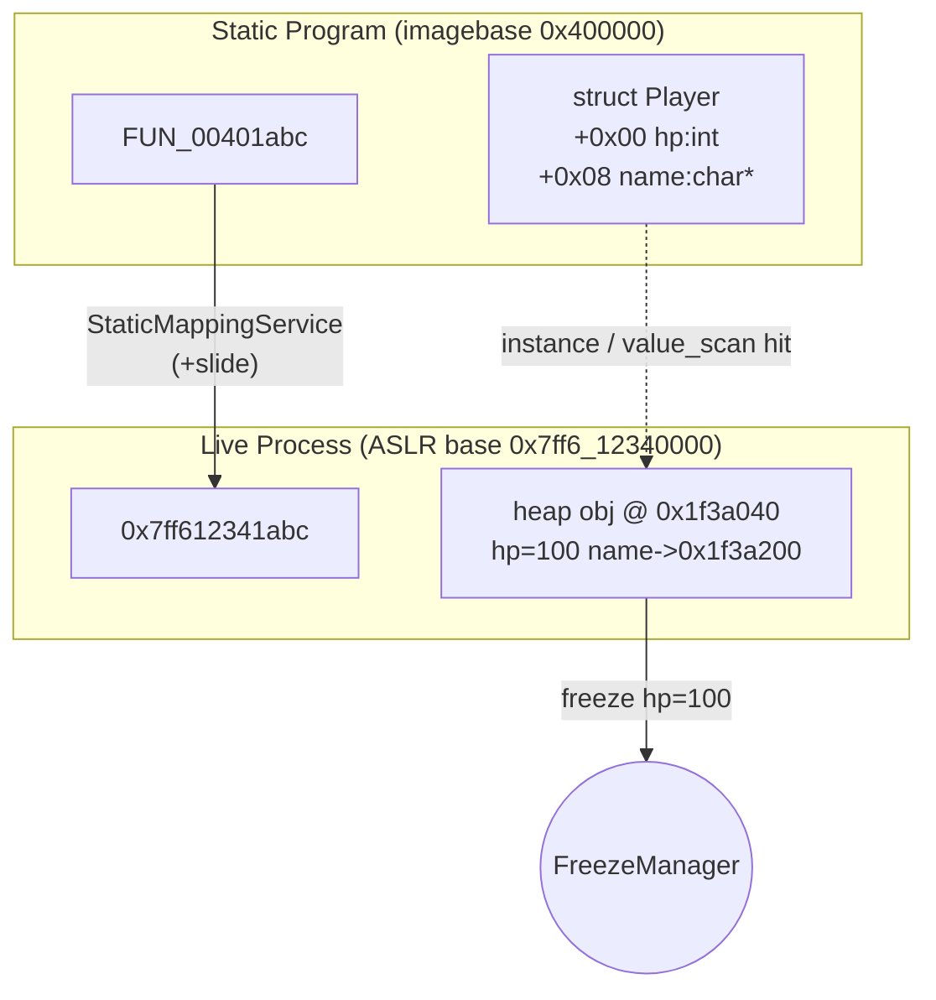
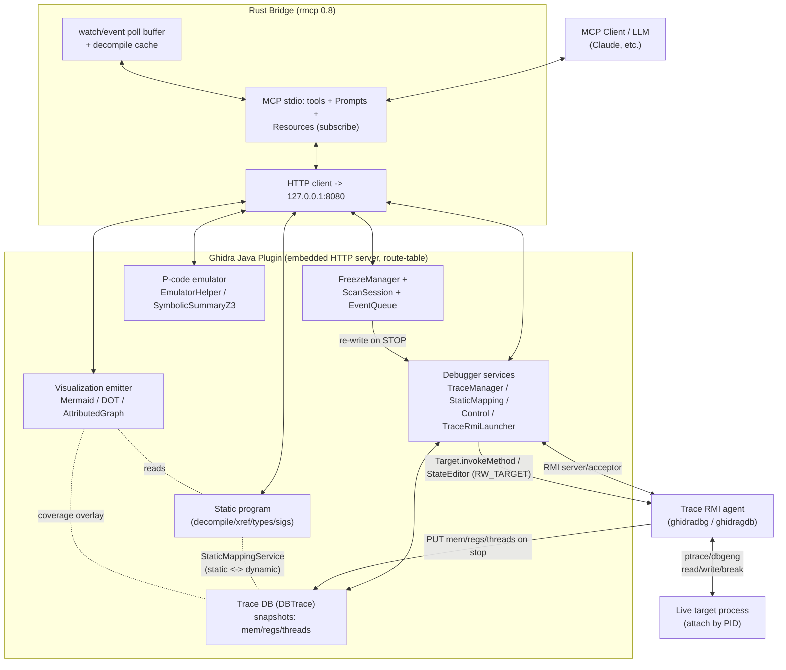

# Ghidra-MCP Enhancement Research Report
## Reverse Engineering with Ghidra Alone — Live Debugging, Native Scanning, and Visual Understanding

---

## 1. TL;DR — Highest-Leverage Moves

- **Yes, Ghidra alone can do everything the user wants.** Ghidra 11.3+ ships a complete native debugger built on **Trace RMI** (a Python agent — `ghidradbg` for Windows/dbgeng — pushes live memory/registers/threads into a Trace database; Ghidra controls the target via `ghidra.debug.api.target.Target`). The 16 debugger tools are stubs only because the Debug-module jars were never staged. **Staging those jars + wiring four Ghidra services is the unlock for the entire "real-time" ask.** (https://github.com/NationalSecurityAgency/ghidra/blob/master/GhidraDocs/GhidraClass/Debugger/B1-RemoteTargets.md)

- **Live WRITE and value-FREEZE are native.** `DebuggerControlService` in `ControlMode.RW_TARGET` routes memory/register writes to the live process (this is the same path as the GUI "Patch" action). Freeze has no native primitive — implement it as a plugin-side re-write loop on every target STOP. (https://github.com/NationalSecurityAgency/ghidra/blob/master/GhidraDocs/GhidraClass/Debugger/A4-MachineState.md)

- **CheatEngine-style value scan / next-scan / pointer-scan are buildable on the Trace's `TraceMemoryManager`** (`getRegionsAddressSet(snap)` + `getBytes(snap,...)`), refined in an in-plugin `ScanSession`. No external app needed.

- **Time-travel debugging is FREE.** Ghidra's Trace DB is already a time-indexed snapshot store — expose `list_snapshots`/`goto_snapshot`/`value_at_snapshot`. This beats CheatEngine and IDA, which have no equivalent.

- **"Diagrams you can see" = emit Mermaid text directly as tool output.** Every chat client renders ```mermaid``` blocks inline with zero infrastructure. Add CFG, xref, namespace, and struct/class diagrams alongside the existing callgraph. (https://clearbluejar.github.io/posts/callgraphs-with-ghidra-pyhidra-and-jpype/)

- **Biggest cheap wins competitors already have:** batch operations (one transaction, ~93% fewer round-trips), FunctionID auto-naming, GDT prototype application, and per-function completeness scoring. (https://github.com/bethington/ghidra-mcp)

- **Turn-based LLM + live state is a solved impedance-match:** poll deltas via `TraceMemoryManager.getStateChanges(fromSnap, toSnap)` and drain a bounded event ring-buffer — never stream. Surface live state as **subscribable MCP Resources**.

- **Recommended backend ranking:** (1) **Ghidra-native Trace RMI debugger** — fits the "Ghidra alone" constraint, gives time-travel + ASLR-correct static↔dynamic mapping; (2) **Frida driven by the bridge** — better ergonomics for inline hooks/Stalker, but adds a dependency; (3) **time-travel/TTD import** — powerful but expensive, defer.

---

## 2. Real-Time / Live Process — The Core Ask

### Can Ghidra itself attach to a running process and modify values/registers live? **Yes — natively.**

As of **Ghidra 11.3 (Feb 2025)**, the legacy IN-VM/GADP/Recorder backends were *removed*; **Trace RMI is the only architecture**. The model:

1. A Python agent (`ghidratrace` + `ghidradbg` for Windows dbgeng / `ghidragdb` / `ghidralldb`) runs alongside the native debugger and **pushes** live state — memory, registers, threads, modules, breakpoints — into Ghidra's **Trace database** (a `DBTrace` of time-ordered snapshots) over Protobuf.
2. **Ghidra is the RMI server/acceptor**; the agent connects back.
3. The plugin **reads** live state by querying the Trace DB at the current snapshot, and **writes/controls** by invoking remote methods on the connected `ghidra.debug.api.target.Target`.

On the user's Win11 box, the relevant launch offer is **`local-dbgeng`** (needs Windows Debugging Tools + bundled `ghidradbg`), which **attaches to a running process by PID** — exactly the "Ghidra attaches to a live process" requirement.

> **Do NOT** try to resurrect the GADP/Recorder API the original stub comments hint at — it's deleted. (https://www.ghidradocs.com/11.3_PUBLIC/docs/WhatsNew.html, https://deepwiki.com/NationalSecurityAgency/ghidra/5.3-trace-rmi-protocol-and-debugger-agents)

### The concrete build path

**Step 1 — Stage the jars** (from a Ghidra ≥11.3 install, via the existing `setup-libs.ps1`/`pom.xml` system-scoped flow):
- `Debugger.jar`
- `Debugger-api.jar` (`ghidra.debug.api.*`)
- `Debugger-rmi-trace.jar` (Trace RMI)
- `TraceModeling.jar` (`DBTrace`, `TraceMemoryManager`, `TraceThread`)

Update `@PluginInfo` to declare `servicesRequired` including `DebuggerTraceManagerService`. Fix the `UNAVAILABLE` message.

**Step 2 — Obtain four services** from `PluginTool` once and stash them (resolve via `tool.getService(X.class)`):

| Service | Role |
|---|---|
| `DebuggerTraceManagerService` | current trace/view/coordinates, `getCurrentTrace()`, `getCurrent().getSnap()`, `activateSnap(n)`, `getCurrent().getTarget()` |
| `DebuggerStaticMappingService` | static↔dynamic address translation under ASLR (`getOpenMappedLocation`, `getOpenMappedLocations`) |
| `TraceRmiService` | accept/connect Trace RMI back-ends; `getAllConnections()` |
| `TraceRmiLauncherService` | enumerate `TraceRmiLaunchOffers` (`local-dbgeng`, `local-gdb`, …) and launch with a program + config map (PID to attach) |

Optionally add `DebuggerControlService` (control mode) and `DebuggerLogicalBreakpointService` (program+trace-spanning breakpoints).

**Step 3 — Wire endpoints in dependency order:**

**(a) Read-only endpoints = pure Trace-DB reads at the current snap** (no native round-trip; agent already synced on stop). Implement first:
- `debugger_read_memory` → `trace.getMemoryManager().getBytes(snap, addr, ByteBuffer)`, hex-encode like existing `hex_dump`.
- `debugger_registers` → `memoryManager.getMemoryRegisterSpace(thread, false).getBytes(snap, register, buf)`; `Register` from `trace.getBaseLanguage().getRegister(name)`.
- `debugger_threads` → `trace.getThreadManager().getLiveThreads(snap)`.
- `debugger_list_modules` → `trace.getModuleManager().getAllModules()` / `getRegionsAtSnap`.
- `debugger_stack_trace` → walk `trace.getObjectManager()` path `Processes[].Threads[].Stack[]`.
- `debugger_status` → report each service non-null + `getCurrentTrace()!=null` + target-alive.

**(b) Static↔dynamic translation (the linchpin for the RE workflow):**
- `debugger_translate_static_to_dynamic` → build `ProgramLocation` from program+addr, call `DebuggerStaticMappingService.getOpenMappedLocation`, return dynamic VA.
- `debugger_translate_dynamic_to_static` → `getOpenMappedLocations(addr)`.
This lets the LLM say "breakpoint at FUN_00401abc" and land at the right runtime VA despite ASLR.

**(c) Control / write endpoints** via `Target.invokeMethod(...).get(timeout)`:
- `debugger_continue`/`step_into`/`step_over`/`break` → `Target.invokeMethod("resume"/"step_into"/"step_over"/"interrupt", args).get()`.
- `debugger_set_breakpoint`/`remove_breakpoint` → prefer `DebuggerLogicalBreakpointService.placeBreakpointAt(...)` so breakpoints map across program+target.
- `live_write_memory` / `live_write_register` → set `ControlMode.RW_TARGET`, then `DebuggerControlService.createStateEditor(trace)` → `editor.setVariable(addr, bytes)` / `editor.setRegister(new RegisterValue(reg, BigInteger))`. Pre-check with `isVariableEditable(addr, len)` for clean errors. (https://ghidra.re/ghidra_docs/api/ghidra/app/services/DebuggerControlService.html)

**Gotchas that break naive implementations:**
- Wrap all Trace mutations in `trace.openTransaction(desc)` (try-with-resources). Reads need no transaction.
- The HTTP handler thread is **not** the Swing thread — marshal GUI-affecting calls (`activateTrace`, `placeBreakpointAt`) onto Swing.
- Control calls return `CompletableFuture` — always `.get(timeout, SECONDS)` so a hung target can't wedge the 127.0.0.1:8080 server.
- The current snap **advances on every stop** — cache nothing across calls.

### Value FREEZE (no native primitive)

Build a `FreezeManager` singleton: `ConcurrentHashMap<Address, byte[]>`. On every **target STOPPED** event (via a `DomainObjectChangeListener` on the Trace or a `TargetExecutionState` transition), iterate frozen entries and re-write via the same `StateEditor`. Encode int/float/string with the program's endianness (`trace.getBaseLanguage().isBigEndian()`). Endpoints: `freeze_value(addr,value,size,type)`, `unfreeze_value(addr)`, `list_frozen`. This mirrors CheatEngine's freeze timer.

### Value SCAN / NEXT-SCAN / POINTER-SCAN (CheatEngine-native, on Ghidra's target)

- **`value_scan(type, value)`** → `snap = current; for each range in mm.getRegionsAddressSet(snap)` (filter to writable/heap): `FlatDebuggerAPI.readMemory(...)` to refresh pages into the trace, then `mm.getBytes(snap, addr, buf)`, slide a typed/aligned window, collect matches into an in-plugin `ScanSession` keyed by `scan_id`. Cap region size + candidate count.
- **`next_scan(scan_id, comparator)`** → re-read **only** surviving candidates, prune in place by comparator (`exact/changed/unchanged/increased/decreased` vs stored prior). Fast because the candidate set shrinks.
- **`scan_results(scan_id)`** → list hits with **both** dynamic and back-translated static addresses (via `DebuggerStaticMappingService`) so the user can label them in the program DB; offer a "freeze this hit" shortcut.
- **`pointer_scan(target_addr, max_depth≤4, max_offset)`** → bounded BFS over pointer-sized/aligned words (`getBytes`), rooted in module static ranges (`trace.getModuleManager()`) so chains are rebasable. `read_pointer_path(chain)` re-resolves live; the leaf feeds `freeze_value`.

### Turn-based LLM ⇄ live state (don't stream — poll deltas)

- **`watch_poll()`** built on **`TraceMemoryManager.getStateChanges(lastPolledSnap, currentSnap)`** — returns exactly which ranges changed; intersect with the watch-list, return one coalesced `{addr, oldHex, newHex, state}` per watched address, advance cursor. (https://ghidra.re/ghidra_docs/api/ghidra/trace/model/memory/TraceMemoryManager.html)
- **`debugger_event_queue_poll(since=seq)`** → bounded sequence-numbered ring buffer fed by a `DomainObjectChangeListener`, returns `{events, nextCursor, dropped}` (gdb/MI async-record model adapted to polling).
- **`set_tracepoint(addr, expr)`** → conditional breakpoint that evaluates-logs-resumes without stopping (gdb `dprintf` style). Hardware watchpoints via `break_read`/`break_write` give CheatEngine's "find what writes here" natively.
- **Tag every live value with `TraceMemoryState` (known/unknown/error)** so the LLM never reasons on stale bytes.

### Backend ranking

1. **Ghidra-native Trace RMI (recommended).** Satisfies "Ghidra alone," gives time-travel + ASLR mapping + reuse of all static analysis. Effort: high but the centerpiece.
2. **Frida driven by the Rust bridge.** Best for inline `Interceptor.attach` hooks (read/modify live args + retval), `Stalker` runtime call-graph/coverage, live `Memory.scan`. Address mapping: `Process.getModuleByName(mod).base.add(ghidraAddr − imageBase)` absorbs ASLR for free. Absorb the frida-mcp tool surface into this bridge rather than running a separate server. Adds a Frida dependency — offer as a complementary backend. (https://github.com/CENSUS/ghidra-frida-hook-gen, https://frida.re/docs/stalker/)
3. **Time-travel / TTD import.** NSA consumes WinDbg's TTD object model via API (don't parse `.run`); rr is just a gdbserver reachable once the live debugger lands. Powerful but "very expensive" per NSA — defer to Phase 3. (https://github.com/NationalSecurityAgency/ghidra/discussions/2917)

---

## 3. Understanding & Connection Diagrams

**Strategy: emit Mermaid text directly as the tool's string result.** Claude, ChatGPT, VS Code, and Obsidian all render fenced ```mermaid``` inline — zero server-side rendering. The existing `callgraph_dot` already proves the BFS+depth pattern; just add a `mermaid()` emitter sibling to `dot()`.

**Graph types to add** (all from stable Ghidra APIs):
- **Call graph** — `Function.getCalledFunctions(monitor)` / `getCallingFunctions(monitor)`. Add `format` (mermaid|dot), `direction` (callers|callees|both), `max_nodes`.
- **Function CFG** — `BasicBlockModel.getCodeBlocksContaining(func.getBody(), monitor)` → `block.getDestinations()` → color edges by `CodeBlockReference.getFlowType()` (true/false/call/fall-through). The single most useful "how does this branch" diagram.
- **Xref graph** — `ReferenceManager.getReferencesTo/From`, BFS to a small radius with a node cap.
- **Namespace/module map** — aggregate call edges to `Function.getParentNamespace()` level; edge label = call count. The "see the whole binary" altitude.
- **Struct/class diagram** — walk `DataTypeManager.getAllStructures()` + `getDefinedComponents()`; pointer/embedded members → composition edges; vtable-scan results → inheritance edges. Emit Mermaid `classDiagram`.

**Scoping (critical for readability):** hard depth + node caps (append a `... (N more)` sentinel), direction selector, collapse external/thunk nodes, and emit the `elk` renderer directive when node count > 40. For genuinely large graphs use `AttributedGraph` + `AttributedGraphExporter` (GEXF/GraphML/JSON) for Gephi/Cytoscape. Optionally serve interactive HTML from the plugin's existing 127.0.0.1:8080 server (`GET /graph/view` embedding mermaid.js). (https://github.com/mermaid-js/mermaid/issues/3262, https://ghidra.re/ghidra_docs/api/ghidra/service/graph/AttributedGraphExporter.html)

### Example (a): function call-graph snippet



### Example (b): static↔dynamic / data-structure relationship map



---

## 4. New Tools to Add (Consolidated, Sorted by Leverage)

| Tool | What it does | Dimension | Effort |
|---|---|---|---|
| `batch_rename` / `batch_set_comment` / `batch_set_variable_type` / `batch_decompile` | Many edits in one Ghidra transaction; ~93% fewer round-trips | MCP ergonomics | M |
| `debugger_status` (real) | Report services + current trace + target-alive | Live debugger | M |
| `debugger_read_memory` (real) | `TraceMemoryManager.getBytes(snap,...)` | Live debugger | M |
| `debugger_registers` (real) | Per-thread register space at current snap | Live debugger | M |
| `debugger_translate_static_to_dynamic` / `..._dynamic_to_static` (real) | ASLR-correct mapping via `DebuggerStaticMappingService` | Live debugger | M |
| `debugger_threads` / `debugger_list_modules` / `debugger_stack_trace` (real) | Trace-DB reads | Live debugger | M |
| `debugger_list_offers` / `debugger_launch` / `debugger_attach(pid)` | Enumerate + launch `local-dbgeng`; attach by PID | Live debugger | H |
| `debugger_set_breakpoint` / `remove_breakpoint` (real) | `DebuggerLogicalBreakpointService.placeBreakpointAt` | Live debugger | H |
| `debugger_continue` / `step_into` / `step_over` / `break` (real) | `Target.invokeMethod(...).get()` | Live debugger | H |
| `live_write_memory` / `live_write_register` | `RW_TARGET` + `StateEditor.setVariable/setRegister` | Live editing | M |
| `freeze_value` / `unfreeze_value` / `list_frozen` | Re-write on every STOP (FreezeManager) | Live editing | M |
| `value_scan` / `next_scan` / `scan_results` | CheatEngine scan on `TraceMemoryManager` + ScanSession | Live scanning | H |
| `pointer_scan` / `read_pointer_path` | Rebasable pointer chains via BFS over module-rooted words | Live scanning | H |
| `watch_add` / `watch_remove` / `watch_poll` | Delta watch via `getStateChanges`; HW watchpoints `break_read/write` | Live streaming | M |
| `debugger_event_queue_poll(since)` | Bounded async event ring buffer (gdb/MI model) | Live streaming | M |
| `set_tracepoint` / `tracepoint_log` | dprintf-style log-and-resume without stopping | Live streaming | H |
| `list_snapshots` / `goto_snapshot` / `value_at_snapshot` / `register_at_snapshot` | Time-travel over the Trace DB | Time-travel | M |
| `find_last_write(addr)` / `history_of_address` | rr-style "who last wrote this" via Lifespan | Time-travel | M |
| `callgraph` (mermaid+direction+caps) | Upgrade `callgraph_dot` | Visualization | L |
| `function_cfg` | Per-function CFG, edges colored by FlowType | Visualization | M |
| `xref_graph` / `namespace_graph` | Neighborhood + module-altitude maps | Visualization | M |
| `struct_diagram` / `class_diagram` | Mermaid classDiagram from types + vtables | Visualization | M |
| `cfg_metrics` | Cyclomatic complexity, loop back-edges | Visualization | L |
| `coverage_overlay_on_callgraph` | Color call-graph nodes by coverage % | Visualization | L |
| `apply_fid_signatures` / `list_fid_databases` | FunctionID auto-naming of CRT/library code | Type recovery | M |
| `apply_gdt` / `list_data_type_archives` | Apply `.gdt` prototypes via `ApplyFunctionDataTypesCmd` | Type recovery | M |
| `recover_rtti_classes` | RTTI→class structs/vftables/namespaces | Type recovery | H |
| `import_pdb` / `import_dwarf` | `PdbUniversalAnalyzer` / `DWARFImporter` | Type recovery | M |
| `propose_struct_from_accesses` / `describe_struct_usage` | `FillOutStructureCmd` p-code struct recovery | AI understanding | M |
| `propagate_types` | Commit decompiler-inferred prototypes via `HighFunctionDBUtil` | Type recovery | M |
| `suggest_names` / `summarize_function` / `apply_function_understanding` | Context-bundle read + atomic apply (LLM is the namer) | AI understanding | L |
| `function_completeness` / `find_next_undocumented` | 0–100 score; self-driving coverage loop | Workflow | L |
| `emulate_function_with_args` | `EmulatorHelper` + calling-convention arg injection | Emulation | M |
| `emu_start/step/run_to/read/write` | Persistent steppable emulator session | Emulation | H |
| `solve_branch_constraints` / `find_path_to_address` | Ghidra 12 SymbolicSummaryZ3 concolic | Symbolic | H |
| `function_hash` / `diff_functions` / `diff_programs` | BSim / Version Tracking similarity + diffing | Diffing | H |
| `bsim_query_function` / `bsim_port_names` | Match stripped funcs to known-binary DB | Diffing | H |
| `load_coverage` / `coverage_report` / `coverage_diff` / `trace_to_coverage` | drcov/EZCOV import + native trace coverage + overlay | Coverage | M |
| `rop_search` / `scan_vuln_patterns` | Gadget enumeration + sink scanning | Exploit | M |
| `list_open_programs` / `select_program` | Multi-program substrate for diffing | Multi-program | M |

Effort: L≈hours, M≈1–3 days, H≈multi-day.

---

## 5. Gaps vs Other RE MCPs

Reference servers: **LaurieWired/GhidraMCP** (~110 tools), **bethington/ghidra-mcp** (245 tools, most feature-rich), **starsong/GhydraMCP** (multi-instance), **mrphrazer/binary-ninja-headless-mcp** (181 tools, deepest IL/dataflow), **drvcvt/radare2-mcp** fork (85 tools, **live debugging + ESIL + ROP + crackme solver**), **jtsylve/re-mcp** (Prompts + Resources + progressive disclosure).

This project's 89 tools are strong on static analysis, malware triage, and signatures, and **uniquely already expose a debugger category** — but it lacks:

- **A working debugger.** drvcvt's r2-mcp ships live debugging today; ours is all stubs. This is the #1 gap and the centerpiece fix.
- **Batch/composite operations.** Competitors collapse 50 edits into one call (bethington: ~93% fewer calls). We do one-item-per-call.
- **Cross-binary similarity + diffing.** The most-praised differentiator (bethington `diff_functions`, RevEng.AI embeddings) — we have AOB signatures only, no function-level similarity, no BSim, no Version Tracking.
- **Multi-program management.** We assume a single current program; diffing needs `list_open_programs`/`select_program`.
- **Emulation-as-a-tool.** drvcvt ships persistent ESIL/RzIL stepping VMs; we have one-shot `emulate` only.
- **Type/symbol auto-recovery exposed.** Ghidra has FID/GDT/PDB/DWARF/RTTI in-process but none is wired through the MCP (only `import_c_header`).
- **MCP primitives beyond tools.** No Prompts (guided workflows as slash commands), no Resources (cacheable static context, subscribable live state), no progressive tool disclosure.
- **Richer visualization.** Competitors emit program-wide call graphs, CFG metrics, and Mermaid; we have DOT-only `callgraph_dot` and `basic_blocks` without edges.
- **Coverage overlay.** None of the Ghidra MCPs do "what actually ran" overlaid on the listing — a differentiator we can own natively from the Trace.

---

## 6. Phased Roadmap

### Phase 1 — Quick Wins (days, pure static, high ROI)
- `batch_rename` / `batch_set_comment` / `batch_set_variable_type` / `batch_decompile` in single transactions.
- Upgrade `callgraph_dot` → `callgraph` with `format=mermaid`, `direction`, `max_nodes`; add `function_cfg`, `xref_graph`, `namespace_graph`, `struct_diagram`, `cfg_metrics`.
- `suggest_names` / `summarize_function` / `apply_function_understanding` (LLM is the namer; thin context-bundle + atomic apply).
- `function_completeness` / `find_next_undocumented` self-driving loop.
- `apply_fid_signatures` + `apply_gdt`; `propose_struct_from_accesses` (`FillOutStructureCmd`); `import_pdb`/`import_dwarf`.
- Add `verbosity` enum + consistent pagination to dump-heavy tools; add server-side decompile cache keyed by program hash.

### Phase 2 — Real-Time Core (the centerpiece)
- Stage the four Debug-module jars; obtain the four services; rewrite `DebuggerHandlers`.
- Read-only debugger endpoints (memory/registers/threads/modules/stack) as Trace-DB reads.
- Static↔dynamic translation via `DebuggerStaticMappingService`.
- `debugger_list_offers`/`launch`/`attach(pid)` for `local-dbgeng`.
- Control endpoints (continue/step/break, set/remove breakpoint) via `Target` + `DebuggerLogicalBreakpointService`, in transactions, marshaled to Swing.
- `live_write_memory`/`live_write_register` (`RW_TARGET` + `StateEditor`).
- `FreezeManager` + `freeze_value`/`unfreeze_value`/`list_frozen` on STOP events.
- `watch_add`/`watch_poll` (`getStateChanges`) + `debugger_event_queue_poll` ring buffer + `TraceMemoryState` freshness tags.
- Expose live state as **subscribable MCP Resources** (`ghidra://debugger/registers`, `ghidra://debugger/watch/{addr}`) emitting `notifications/resources/updated`.

### Phase 3 — Advanced
- `value_scan`/`next_scan`/`scan_results` + `pointer_scan`/`read_pointer_path` (CheatEngine-native).
- `set_tracepoint` + hardware watchpoints ("find what writes here").
- Time-travel: `list_snapshots`/`goto_snapshot`/`value_at_snapshot`/`find_last_write`; `record_start/stop` (sparse-snapshot poor-man's TTD); optional WinDbg TTD import.
- Coverage: `load_coverage` (drcov/EZCOV) + `coverage_report`/`coverage_diff` + `trace_to_coverage` (native from Trace) + `coverage_overlay_on_callgraph`.
- Symbolic: `emulate_function_with_args` (`EmulatorHelper`); `solve_branch_constraints`/`find_path_to_address` (Ghidra 12 SymbolicSummaryZ3 + bundled libz3); `SymbolicPropogator` fallback to upgrade `extract_constraints`.
- AI/diffing: `function_hash`/`diff_functions`/`diff_programs` (BSim/Version Tracking); `bsim_query_function`/`bsim_port_names`; multi-program `list_open_programs`/`select_program`.
- Visualization: interactive HTML graph view from the plugin server; `AttributedGraphExporter` for huge graphs.
- MCP: Prompts (`survey_binary`, `analyze_function`, `trace_live_value`) + progressive tool disclosure (`list_tool_groups`/`search_tools`/`get_schema`/`call`).
- Optional Frida backend (`frida_hook_function`, `frida_stalker_trace`, `frida_read/write/scan`).

---

## 7. Architecture Connection Map



**Key data flows:** the agent **pushes** state into the Trace DB on every stop; read-only tools query the Trace; control/write tools invoke the `Target` (which reaches the live process); the `FreezeManager` re-asserts values on each STOP; `StaticMappingService` correlates the analyzed program with the ASLR'd live process; the visualization emitter reads both static structure and live coverage to produce Mermaid the client renders inline.